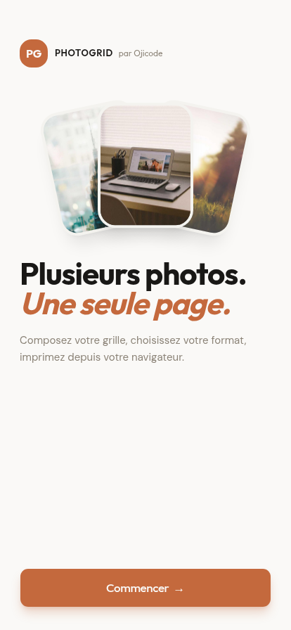

# PhotoGrid

[](./LICENSE)
[](https://photogrid.ojicode.fr)
[](https://photogrid.ojicode.fr)

Imprimez plusieurs photos sur une seule feuille. PhotoGrid compose une grille de
photos et l'imprime à l'échelle millimétrique exacte, aux formats
**A4 / A5 / Letter / Legal**. Tout se passe dans le navigateur : aucune photo
n'est envoyée sur un serveur, et l'application fonctionne hors-ligne.

Pratique pour des planches photo, des mosaïques, des contact sheets, ou pour
caser plusieurs tirages sur une même page sans gâcher de papier.

**React 19 + Vite + Tailwind 4 + base-ui.** Application 100 % client, installable
(PWA), aussi packagée en application Android via Capacitor.

- Application web : https://photogrid.ojicode.fr
- Application Android (APK signé) : voir les [Releases](https://github.com/ojicodehq/photogrid/releases)

## Aperçu




## Fonctionnement

1. Ajoutez vos photos.
2. Choisissez le format de page (A4, A5, Letter, Legal) et l'orientation.
3. Réglez la grille : colonnes, lignes, marges, espacement.
4. Imprimez ou exportez en PDF, au format millimétrique exact.

## Sous le capot

- **Aucun backend.** L'import, le redimensionnement, la composition et la
  génération du PDF se font entièrement dans le navigateur. Les images ne quittent
  pas l'appareil.
- **Rendu à l'échelle physique.** La mise en page est calculée en millimètres :
  ce qui s'affiche correspond aux dimensions réelles du format choisi, sans mise à
  l'échelle surprise de l'imprimante.
- **PDF hors du thread principal.** La génération tourne dans un Web Worker pour
  ne pas figer l'interface sur les gros lots d'images.
- **Hors-ligne et installable.** Service worker géré par Serwist, stockage local
  des photos via IndexedDB.
- **Android.** La même base web est empaquetée avec Capacitor et reçoit des mises
  à jour live (OTA) chiffrées de bout en bout.

Quelques points d'entrée pour lire le code :

- `src/lib/pdf/` : génération du PDF dans un Web Worker.
- `src/lib/printService.ts` : impression navigateur à l'échelle exacte.
- `src/lib/photoStorage.ts` : persistance locale des photos (IndexedDB).
- `src/components/photogrid/` : composition et aperçu de la grille.
- `src/lib/strings/fr.ts` : tous les textes de l'interface, centralisés.

## Explorer le code en local

Node.js >= 20.

```bash
npm install
npm run dev        # serveur de dev Vite (http://localhost:5173)
npm run build      # build de production vers dist/
npm run preview    # prévisualise le build de production
npm run lint       # ESLint
```

## Licence

Code source ouvert sous licence **AGPL-3.0** : voir [`LICENSE`](./LICENSE). Vous
pouvez l'utiliser, le modifier et le redistribuer, à condition de publier les
sources de toute version déployée (y compris en service web).

© 2026 Nicodème Cajuste (Ojicode).
